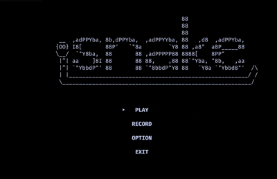

# 🐍 Snake Game (C / Terminal)

A classic Snake game written in pure C for the terminal.  
No engines, no frameworks — just low-level control and raw terminal rendering.

---



---

## ✨ Features

- 🎮 Smooth terminal gameplay
- ❤️ 3 lives system (respawn after collision)
- ⏸️ Pause / Resume (Space)
- 🏆 Score tracking
- 📺 Retro ASCII-style graphics
- 💀 Game over screen with restart option
- 🎯 Main menu with title screen

---

## 🎮 Controls

| Key        | Action        |
|------------|--------------|
| W / ↑    | Move up       |
| S / ↓    | Move down     |
| A / ←    | Move left     |
| D / →    | Move right    |
| Space    | Pause / Resume|
| Q        | Quit game     |

---

## ⚙️ Build & Run

`bash
git clone https://github.com/JonesAccount/snake-game-c.git
cd snake-game-c/build

cmake ..
make
./snake

## 🗂️ Project Structure

```
snake-game-c/
├── src/          # Source code (.c files)
├── includes/     # Header files (.h)
├── assets/       # Images and demo GIF
├── saves/        # Save data / high score
└── CMakeLists.txt
```
